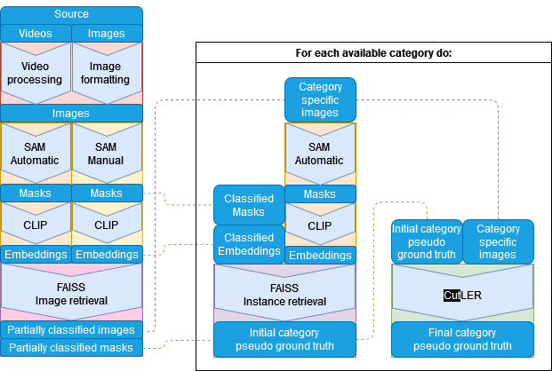
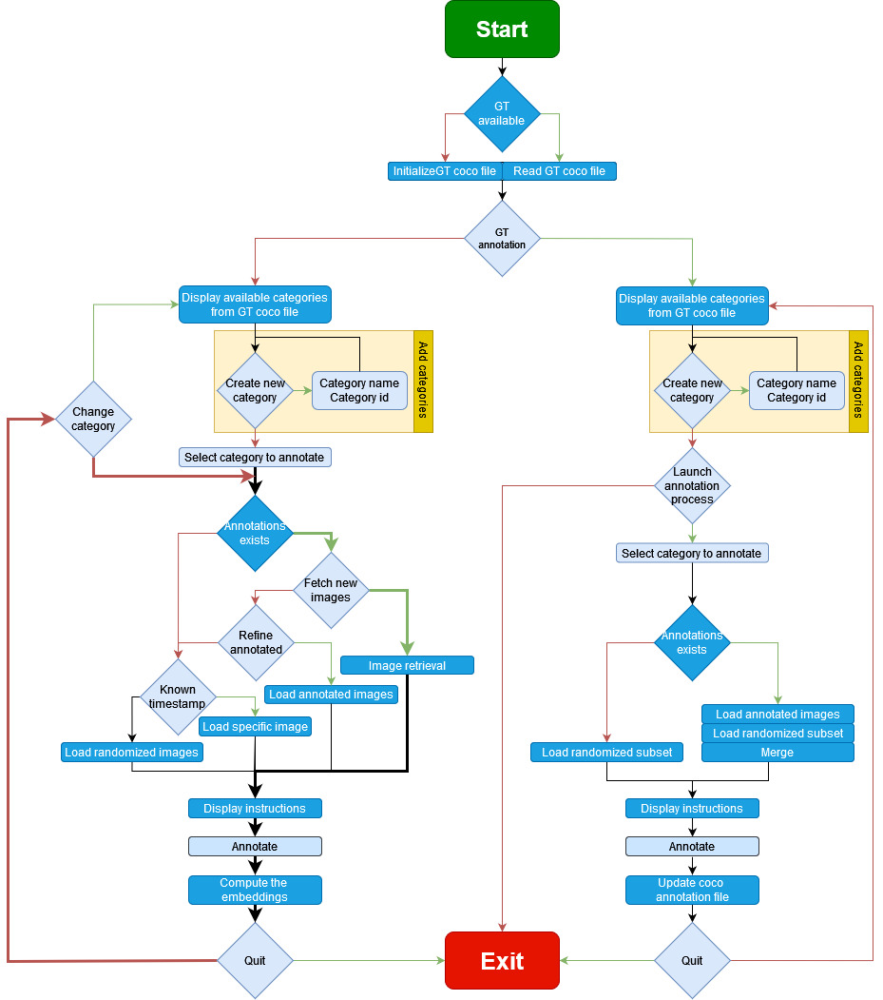

# Table of content 
0. [Structure](#structure)
1. [Pipeline](#pipeline)
2. [Processing **video** files](#from_videos)  
	1. [Image collection](#collecting_images)   
	2. [Mask and embedding collection](#collecting_masks_and_embeddings)  
	3. [Manual annotation generation](#generating_manual_annotations)  
		1. [Category definition](#defining_categories)  
		2. [Example collection](#collecting_examples)  
		3. [Groud truth generation](#collecting_ground_truth)  
	4. [GT_macthing](#GT_matching)
	5. [Image retrieval](#image_retrieval)
3. [Processing **image** files](#from_images)
	1. [Image collection](#collecting_imagesII)
	1. [Adaptations](#adaptations)
		1. [Ground truth adaptation](#gtmatching)
		2. [Manual annotations](#manualannotations)

# 0. Structure  

The released code is organized into two main folders.

## 00_Deliverable 

**00_Deliverable** contains the automated scripts enumerated in the [section 1.](#pipeline)  
Additionally:

- The `sub_` files are subprocesses called by the scripts to faster process the masks and the embeddings, as described in the report.
- The `helper` folder contains the following files:
	- `CLIP.py`: CLIP related functions.
	- `SA_annotationTool.py`: annotation tool functions.
	- `annotations.py`: everything to encode, filter, match, evaluate SAM json masks.
	- `coco.py`: functions to create, manipultate, and modify coco annotation files.
	- `common_libraries.py`: imports all the essential libraries such as np,sns,plt,pd...  
	- `dataframes.py`: everything to read, stack, modify, merge, filter csv dateframes.
	- `dijkstra.py`: the functions to build graphs and run the shortest path algorithm.
	- `faiss.py`: everything to initilize or augment faiss indices, as well as manipulate the associated data.
	- `lib_SA`: SAM related functions.
	- `lib_detectron2`: everything to register, load, or visualize datectron2 catalogs.
	- `path.py`: everything to manipulate paths to data. Most of the functions rely on the `timestamp_id` format described in the repport.
	- `scriptIO.py`: everything to request stuff from the user and display images, while the main scripts are running.
	- `tuning.py`: used to change some native 3-line commands to 1-line functions.
	- `videos.py`: all the functions to run the video processing.  
	
- The `config` folder contains the following files:
	- `paths.py` all the paths where to store and fetch the data from.
	- `parameters` all the parameters used different files.
	
The `companion_notebook` folder is not submitted for grading but contains some useful examples of how to use some of the designed functions.  
Furthermore, it contains the notebooks used to compute the parameters and the results of the delivered pipeline. 

[Home](#toc)	

# 1. Pipeline 

The **Source*  &rarr; *Partially classified images/masks** part is fully implemented.

1. The process highlighted in light red is `00_images_from_src.py`. 
1. The process highlighted in orange is `01_collect_masks.py`.
1. The process highlighted in yellow is `02_manual_annotations.py`.
1. The process highlighted in pink is `04_image_retrieval.py`

1. An additionnal process `03_GT_matching.py` is also made available.

The **For each available category do** part is partially implemented.

1. The *instance retrieval* process is highly similar to the *image retrieval* process.
2. The proof of concept of the *_LER* part is achieved through the `12_CutLER_sp10_tr123.ipynb` and `14_CutLER_real_tr4...ipynb`  
   It is required to change the defined paths accordingly to process the desired dataset.

[Home](#toc)

# 2. Processing **video** files 

## 2.1. Image collection 

1. Run `00_images_from_src.py`.
2. Enter `y` when prompted with `from video [y/n]`.
2. The script guides you for the other parameters:  
	- `channel` ← type the name of an existing video channel located at `{path_root_videos}`[^1].
	- Expecting a growing dataset, it is possible to limit the processing to a specified period of time:  
	  `Period [y/n]` ← `y`  
	  `From:` ← `2023-03-01`  
      `To:` ← `2023-05-31`  
	  This will process data only for the month of March, April, and May in the year 2023. 
		 
	- Additionally, it is possible to exclude a period of time from the processing:  
	  `Except [y/n]` ← `y`  
	  `From:` ← `2023-04-01`  
	  `To:` ← `2023-04-30`  
	  This will skip the data processing for the month of April in the year 2023.
	
	- `similarity threshold` ← enter the desired similarity threshold.
	- `sampling interval` ← enter the desired sampling interval.
	
3. The video processing starts. 
	
	- The images are saved in directories organized in the same manner as the videos directories.
	- They are named `{timestamp_id}.jpg`, as detailed in the repport.  
	> The image directory is rooted at `{path_root_images_from_src}/{channel}`  
	
You can tune other parameters such as the `pruning_interval`, `minimum_light`, `max_width`, `deadtime`  from the `config/parameters.py` file.

[Home](#toc)

## 2.2. Mask and embedding collection 

1. Run `01_collect_masks.py`.
2. The script guides you selecting the different parameters:  

	- `channel` ← type the name of an existing image directory located at `{path_root_images_from_src}`.
	- It is possible to define an **Area of Interest** (AoI). Enter `y` when prompted with `AoI [y/n]`.
		
		- A random image from the directory is displayed and you are prompted to click on the left, respectively the right imaginary axis defining the AoI.
		- The shown image is updated. The new preview image is displayed, on which the AoI is hidden.
		- Enter `y` when prompted with `validate background area [y/n]` if you are satisfied.
	
	- `points per side` ← enter the desired segmentation granularity.
	- `points per batch` ← enter the desired batch size.
	
		- A random image from the directory is displayed together with its masks.
		- Enter `y` when prompted with `validate segmentation [y/n]` if you are satisfied.

3. The processing starts.  

	- Each processed image creates a json file `{timestamp_id}.json` containing its associated masks.  
	- Each mask file creates an associated csv file `{timestamp_id}.csv` containing its associated embeddings.  
	> The masks are located at `{path_root_masks_from_images}/{points_per_side}/{channel}`.  
	  The embeddings are located at `{path_root_embeddings_from_masks}/{points_per_side}/{channel}/df_images`.
	
4. The process is done.

	- Information about the process and the nb of collected masks is saved in the `info_dict.json` file.
	- The saved-by-image csv files are stacked together until `nb_max_rows`[^2] = 30k is reached. This creates *k* `merged{i}.csv` files for i = 0,1,...,k.  
	- A dictionary `merged_dict.json` containing the mapping `timestamp_id:i` is created.  
	> The `info_dict.json` is located at `{path_root_masks_from_images}`.  
	  The merged file are located at `{path_root_embeddings_from_masks}/{points_per_side}/{channel}/df_merged`.  
	  The `merged_dict.json` is located at `{path_root_embeddings_from_masks}/{points_per_side}/{channel}`.  

	  
[Home](#toc)

## 2.3. Manual annotation generation 

The manual annotation tool has two channels:    

1. Manual annotation for ground truth generation (right).
2. Manual annotation for examples generation (left).

The full process of both channel is detailed in the following figure.  

- The diamond boxes represent boolean decision where the green and the red arrows state for True, False, respectively. 
- The rectangles boxes represent actions.
- The deep blue parts represent decisions and processes that are independent from the user.  
- The light blue parts represent the decisions and processes that depend on the user. 
- The bold arrows represent the *examples collection* process for a single category.

[Home](#toc)

### 2.3.1 Category definition 

1. Run `02_manual_annotations.py`.
2. Enter `n` when prompted with `ground truth [y/n]`.  
3. `channel` ← type the name of an existing image directory located at `{path_root_images_from_src}`.  
4. The corresponding `{channel}_coco_dict.json` located at `{path_root_GT}/{channel}` is read/initialized.
5. `create new category [y/n]` ← `y`.  

	- `category name`  ← enter a name for the new category
	- `category id` ← enter an id for the new category
	- The new category is added to the json file.  
	  Repeat 5. for each as many times as requested.   
	  
[Home](#toc)
	 
### 2.3.2 Example collection 
	
6. Pick the category to annotate among the displayed categories. 
7. When no annotation is available, you can enter the `timestamp_id` of an image containing an object example of the category you are currently annotating.  
   This allows you to quickly provide an example to the **quick image retrieval** process. 
8. Once at least one instance is annotated. You can leave the annotation process. 
9. The embedding(s) of the annotated instance(s) is/are computed.
10. At the next annotation round of the same category (`change category` ← `n`), the **quick image retrieval** shows you 
    `k_quick_candidates`[^2] new images featuring similar objects for each annotated examples.   
11. The results of this work are based on `nb_manual_annotations`[^2] = 20. Hence, it is required to annotate 20 instances of each category.
12. The `timestamp_id` of the annotated images are saved in a `image_dict.json` dictionary.  

    > The masks are located at `{path_root_manual_annotation}/{channel}/ann_images`.  
	  The embeddings are located at `{path_root_manual_annotation}/{channel}/df_images`.  
	  The merged embeddings are located at `{path_root_emembeddings}/{channel}/df_merged`.  
	  The `image_dict.json` is located at `{path_root_manual_annoation}/{channel}`.
	  
<u>Note:</u> since `nb_manual_annotations` = 20 and `nb_max_rows` = 30k, it would take 1500 categories to create more than 1 merged file.  
As this is never the case during this work, some parts of the code assume a single merged file for the manual annotation embeddings.

[Home](#toc)

### 2.3.3 Ground truth generation  
As depicted in the above figure, it is possible to create a ground truth using the annoation tool. The dataset `jerry_real` has been annotated using this method.  
Similarly to having a train set and a test set, having two different annotation channels allows to separate the ground truth annotations from the example annotations.  
As the script guides the user in a seamless manner, and having the *If Statement Diagram* available, the steps for the ground truth annotation are not further detailed.

> The files `{timestamp_id.json}` containing the masks produced during the ground truth generation are located at `{path_root_GT}/{channel}/ann_images`.  
  They are formated to the coco format and saved in the `annotations` field of the `{channel}_coco_annotations.json` file at the end of the annotation process. 

[Home](#toc)

## 2.4 GT matching 

**If a ground truth is available**, you can run the script `03_GT_matching.py`.

1. Run `03_GT_matching.py`.
2. `points per side` ← enter the number of points per side used to compute the masks and embeddings.
3. `channel` ← enter the channel to process.

This will replace the default values of the fields `in_GT`, `GT_id` `GT_category` for:

- the mask files located at `{path_root_masks_from_images}/{points}/{channel}`.
- the merged embedding files located at `{path_root_embeddings_from_masks}/{points}/{channel}/df_merged`

[Home](#toc)

## 2.5 Image retrieval 
1. Run `04_image_retrieval`.
2. `points per side` ← enter the number of points per side used to compute the masks and embeddings.
3. `channel` ← enter the channel to process.
4. The image retrieval process is ran for each available category. These are the categories having manual examples.
5. The categorized embeddings are gathered in a `{category_id}.csv` file.
   > The `{category_id}.csv` files are located at `{path_root_embeddings_from_masks}/{points_per_side}/{channel}/df_categorized`.  
6. The retrieved images are copied to a directory named `{category_id}` for further processing and visualization purposes.  
   > The `{category_id}` directories are located at `{path_root_image_retrieval}/{channel}`.  
7. A `category_dict.json` dictionary is created. The latter maps `category_id:category_name`.  
   > The `{category_dict.json}` is located at `{path_root_image_retrieval}/{channel}`.  
8. The `timestamp_id` of the images are saved in the `image_dict.json` file previously initialized.  

   
<u>Note:</u> None of the `merged{i}.csv` files are modified during this step. Instead, the retrieved rows are copied to `{category_id}.csv` before modifying the `category_id` field.

[Home](#toc)

# 3. Processing **images** files 

As any image data obtained via the videos is unlabeled, the main goal of this part is to provide a way to load annotated datasets.  

- The pipeline relies on the `timestamp_id` of the images to quickly find the images to crop using the segmentation masks outputted by SAM.  
  As the annotated datasets comes from other sources, the [section 3.1.](#collecting_imagesII) explains how any dataset can be formatted to align with the necessary format.  
  
- Once the images are loaded and the image names formated, the [section 3.2](#adaptations) explains the further required steps to be able to run the image retrieval and the rest of the pipeline as if  
  the images were originated from videos. 
  
  	- The ground truth associated to the loaded dataset must be adapted, as described in  [section 3.2.1.](#gtmatching).
  	- Manual annotations must be provided, as described in  [section 3.2.2.](#manualannotations). 

## 3.1. Image collection 

1. Run `00_images_from_src.py`.
2. Enter `n` when prompted with `from video [y/n]`.
2. The script guides you for the other parameters:  
	- `path to source directory` ← enter the path to the directory where the images are located.
	- `new channel name` ← give a 7 characters name to the new pseudo-channel (such as CH00001, CH00004, ARM0001, ...)
	
3. The image formatting starts. 
	- The images are saved in directories organized in the same manner as they where coming from a video channel.
	- They are located at `{path_root_images_from_src}/{channel}/`[2023/03/18](https://www.globalrecyclingday.com/).
	- They are named from `{channel}_20230318_000000.jpg`, up to `{channel}_20230318_999999.jpg`.

4. The image formatting is done.
	- A dictionnary `channel_dict.json` is created.  
	  It contains a name dictionary, mapping `name_in_the_original_folder`:`2023/03/18/{timestamp_id.jpg}`

<u>Note:</u> The image are outputted as `pnj` files.

[Home](#toc)

## 3.2 Adaptations 

### 3.2.1 Ground truth formating  

1. Create a copy of the original ground truth file, name it `{channel}_coco_annotations.json`, and store it at {path_root_GT}/{channel}.
2. Use the `channel_dict.json` file to replace all the `file_name` fields of the cocos' `images` dictionaries.  
3. Adapt the rest of the ground truth to match the typical coco format.

	> To get some inspiration, have a look at the companion notebook `GT_matching.ipynb`.  
	  You can follow the formating performed on the `Innorecycling objects` (WSM0001), `COCO` (ARM0002), and `LVIS` (ARM0001) datasets.
  
4. Once the dictionary is formated, you can run `03_GT_matching`, as explained the [section 2.4.](#GT_matching) 

### 3.2.2 Manual annotations 

- If the number of categories is reasonable, you can annotate the 20 required example using the annotation tool, as explained in the [section 2.3.2.](#collecting_examples)
- Alternatively, you can extract 20 annotations per category from the ground truth and save them at `{path_root_manual_annotation}/{channel}/ann_images`, *as if* they were originated from annotation tool.   
  If you decide to do so, you need to run the annotation tool to compute the embeddings once the annotations are copied at the requested location.  
  Run the annotation tool  as explained in the [section 2.3.2.](#collecting_examples) but quit the process without annotating anything. The embeddings will be computed.
  
  	> To get some inspiration, have a look at the companion notebook `GT_matching.ipynb`.  
	  You can follow the annotation extraction performed on the `COCO` (ARM0002) dataset.
 
<u>Note:</u> **Pay attention to the dataset's image size**. The masks are cleaned using the `th_min_area`[^2] parameter. If you don't adapt it accordingly, you might get some surprises.  

[Home](#toc)

[^1]: All `path_root...` are defined in the `config/paths.py` file.
[^2]: Defined in the `config/paramters.py` file.
